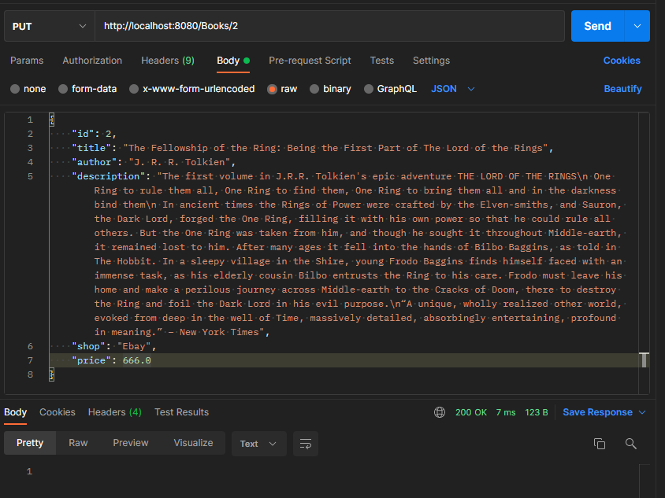

# Rapport création API REST SpringBoot
Par Mathieu Tabary - novembre 2021 - Master 2 Ingénierie Logiciels

Version de Java : 11
Adresse de l'API : localhost/
Port de l'API : 8080
url d'accès : http://localhost:8080/Books

## Données traitées
Les données utilisées sont des descriptions de livres (réutilisées d'un TP d'IDEC).

Un objet-livre est composé comme suis : 
 - Un id (pas nécessairement unique)
 - Un titre
 - Un auteur
 - Une description
 - Un magasin où le livre est vendu
 - Le prix du livre dans ce magasin

Les données sont réinitialisées à chaque lancement de l'application.
Les données de bases sont 4 livres de J.R.R. Tolkien ou des livres qui parlent de son œuvre.

## CRUD
### Create
La création d'objet se fait via une requête POST.

L'objet que l'on ajoute est renseigné dans le corps de la requête.

Tous les champs sont remplis par l'utilisateur, il faudrait modifier ceci pour que les ids soient uniques et gérés par l'application.

### Read
La lecture des objets se fait via GET.

L'endpoint http://localhost:8080/Books/ liste toutes les données de l'API.

L'endpoint http://localhost:8080/Books/{id} affiche le livre avec l'id demandé.

### Update
Les modifications se font via PUT.

L'endpoint utilisé est http://localhost:8080/Books/{id}

L'objet passé en paramètres (corps de la requête) doit être complet.

## Problèmes rencontrés
- Comment gérer les erreurs ?
- Gestion des objets avec des id identiques / Comment forcer l'unicité des ids ?
- Création d'objet héritant d'une interface / Le parser par défaut n'arrive pas à créer des objets issus d'une interface.
